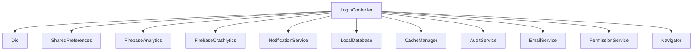
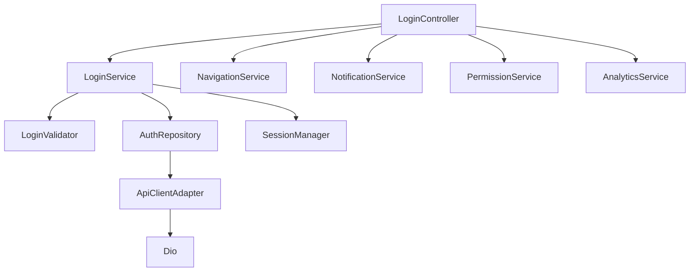

# SRP Single Responsibility Principle

### Uma classe deve ter um único motivo para mudar

- Mudou a API de login?
- Mudou a regra de validação?
- Mudou a biometria?
- Mudou a criptografia?
- Mudou a navegação?
- Mudou o banco local?
- Mudou o analytics?

Se for sim para todas as perguntas então possui várias responsabilidades

### Objetivo

- Facilitar manutenção.
- Facilitar testes.
- Reduzir impacto das mudanças.
- Melhorar legibilidade.

O SRP foi definido originalmente para classes e módulos, mas a ideia de uma única responsabilidade / um único motivo para mudar também se aplica muito bem a funções e métodos.

### O que mudou?

O LoginController agora é responsável por coordenar o fluxo de login.

O LoginService é responsável por autenticar o usuário e iniciar sua sessão.

O AuthRepository é responsável pela comunicação com a API.

Cada classe possui um motivo mais claro para mudar.

## Versão antiga:

## Versão nova:

