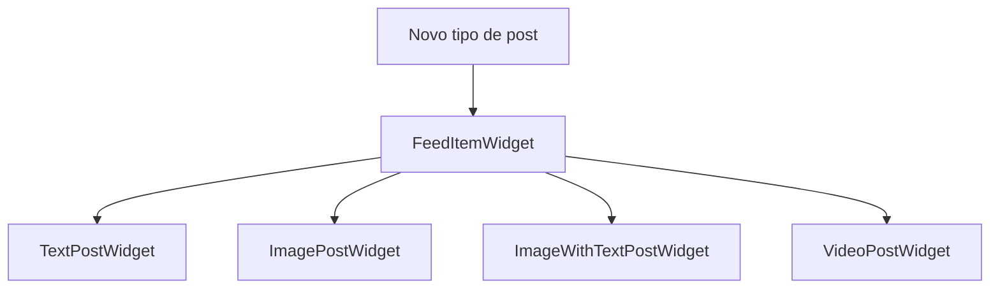
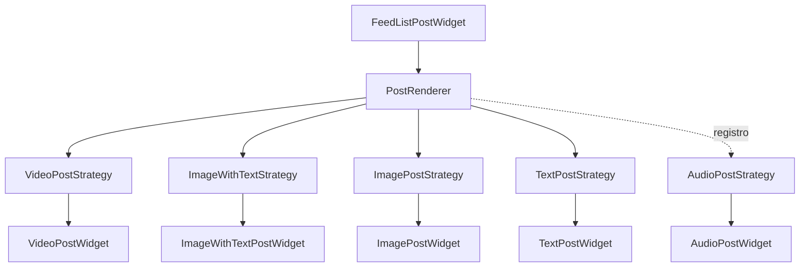

# OCP Open/Closed Principle

### Entidades devem estar abertas para extensão e fechadas para modificação

O objetivo do OCP é permitir que novos comportamentos sejam adicionados ao sistema sem alterar código já existente e validado.

Ao invés de modificar classes toda vez que surge um novo requisito, criamos novas implementações que se integram à solução existente.

### Problema

Na versão antiga, a tela precisa conhecer todos os tipos possíveis de post.

Sempre que um novo tipo é criado, a mesma classe precisa ser modificada.

Isso aumenta o acoplamento e faz com que o widget cresça indefinidamente.

### Objetivo

- Facilitar evolução do sistema.
- Reduzir regressões.
- Evitar alterações em código já validado.
- Melhorar extensibilidade.
- Permitir novos comportamentos através de composição.

### O que mudou?

O `FeedItemWidget` deixou de conhecer todos os tipos de post.

Agora cada tipo de conteúdo possui sua própria estratégia de renderização.

O `PostRenderer` apenas encontra a estratégia adequada e delega a renderização.

Quando um novo tipo de post surge, basta criar uma nova estratégia e registrá-la.

Nenhuma classe existente precisa ser modificada.

## Versão antiga:



## Versão nova:



## Adicionando um novo tipo de post

Suponha que o produto agora precise suportar áudio.

Criamos apenas uma nova estratégia:

```dart
class AudioPostStrategy implements PostRenderStrategy {
  @override
  bool canRender(PostEntity post) {
    return post.media?.type == MediaType.audio;
  }

  @override
  Widget build(PostEntity post) {
    return AudioPostWidget(post);
  }
}
```

E registramos:

```dart
AudioPostStrategy(),
```

Nenhuma outra classe precisa ser alterada.

## Como identificar uma violação de OCP?

Pergunte:

- Preciso editar uma classe existente para adicionar um novo comportamento?
- Existe um `if`, `switch` ou `Visibility` crescendo sem parar?
- A mesma tela precisa conhecer todos os tipos possíveis?
- Cada nova funcionalidade exige alterar código já funcionando?

Se a resposta for sim, provavelmente existe uma oportunidade para aplicar o Open/Closed Principle.
