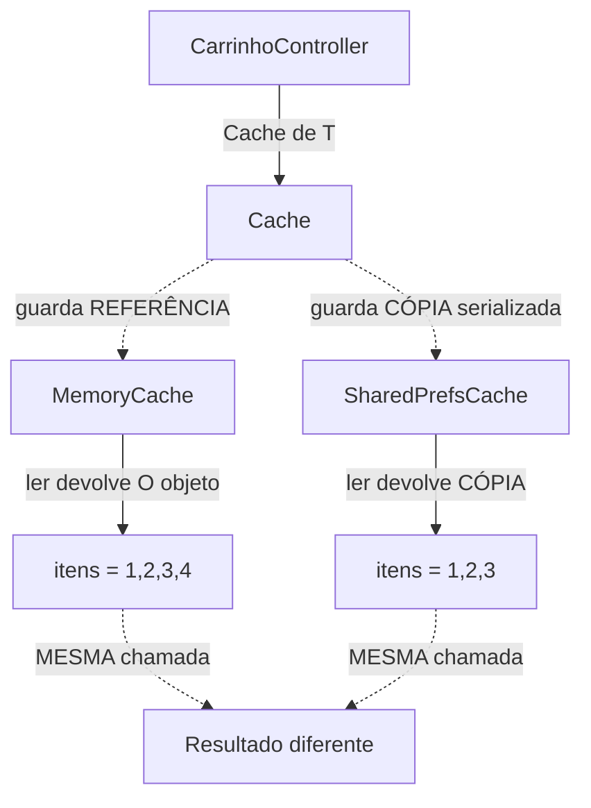
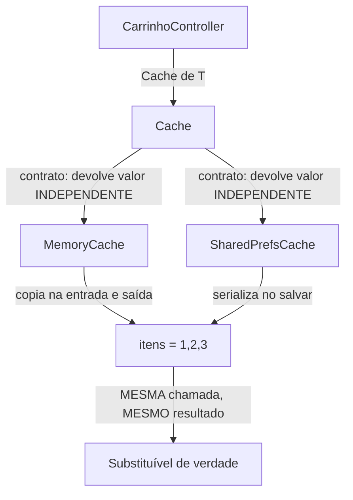

# LSP Liskov Substitution Principle

### se o código funciona com a classe base, tem que continuar funcionando com qualquer subclasse

- Mudei a implementação por trás da interface...
- ...e o cliente quebrou sem mudar nada no código dele?
- O resultado depende de QUAL implementação foi injetada?
- Preciso saber a classe concreta para prever o comportamento?

Se for sim então o subtipo não é realmente substituível e o LSP foi violado

### O ponto que costuma passar despercebido

No Flutter o null safety e o analyzer garantem que os **tipos** são substituíveis:
mesma assinatura, mesmo retorno, tudo compila. Mas o LSP é sobre **comportamento e contrato** — e isso nenhuma ferramenta estática do Dart verifica.

A interface promete _"guarde e me devolva"_, mas:

- `MemoryCache` guarda a **referência** e devolve **o mesmo objeto**.
- `SharedPrefsCache` **serializa** e devolve **uma cópia** reconstruída.

Com `String` (imutável) a diferença é invisível. Com tipo mutável o contrato quebra: mutar o objeto original depois do `salvar` vaza para dentro do `MemoryCache`, mas não para o cache serializado.

### Objetivo

- Garantir que abstrações sejam confiáveis.
- Permitir trocar implementações sem efeitos surpresa.
- Evitar bugs que só aparecem em produção (testou com o cache de memória, quebrou com o real).
- Tornar contratos explícitos em vez de implícitos.

O LSP vai além da assinatura de tipos: ele cobre pré-condições, pós-condições e invariantes. Um subtipo não pode enfraquecer o que promete entregar nem fortalecer o que exige receber.

### O que mudou?

A interface `Cache<T>` passou a documentar um contrato **explícito**: toda implementação devolve um valor **independente** do objeto original.

`MemoryCache` agora recebe uma função de cópia e copia na entrada e na saída, honrando a mesma promessa do cache serializado.

`SharedPrefsCache` deixou de ficar travado em `String` e passou a aceitar qualquer `T`, com serialização explícita injetada.

As duas implementações se comportam igual do ponto de vista do cliente. A escolha entre memória e disco vira detalhe de infraestrutura, não uma mudança de comportamento.

## Versão antiga:

## Versão nova:

