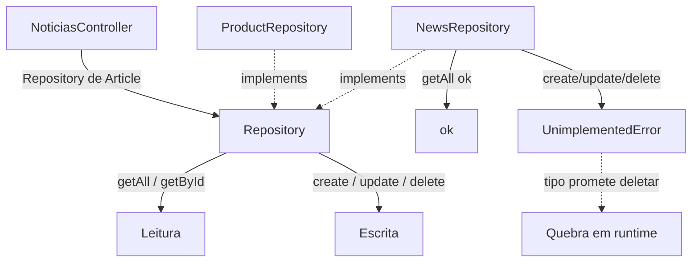
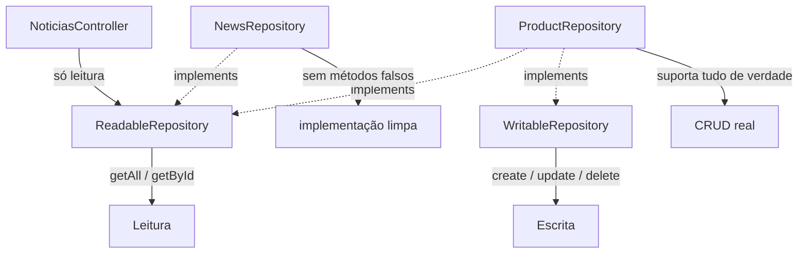

# ISP Interface Segregation Principle

### Nenhuma classe deve ser forçada a depender de métodos que não usa

- A interface obriga a implementar algo que esta classe não suporta?
- Sobrou `UnimplementedError` / `throw` só para satisfazer o contrato?
- O cliente enxerga métodos que nunca deveria poder chamar?
- Mudar um método "alheio" da interface obriga esta classe a recompilar/mudar?

Se for sim então a interface está "gorda" e o ISP foi violado

### O problema da interface gorda

Uma única interface grande tenta servir a todos os casos. Quando uma implementação só precisa de parte dela, é forçada a "preencher o resto":

- `NewsRepository` é **read-only**, mas a interface `Repository<T>` exige `create`, `update` e `delete`.
- Sobra implementar esses métodos com `UnimplementedError` — código sujo que existe só para o compilador parar de reclamar.

### A ponte com o LSP

A interface gorda quase **força** uma violação de LSP. O tipo `Repository<Article>` promete que dá para deletar; o cliente confia no tipo e chama `delete`; estoura em runtime. O subtipo não consegue honrar tudo que a interface promete.

ISP bem aplicado **previne** esse tipo de violação de LSP: a fonte só implementa o que consegue honrar de verdade.

### Objetivo

- Manter interfaces pequenas, coesas e focadas.
- Fazer o cliente depender só do que realmente usa.
- Eliminar implementações "de mentira" (`UnimplementedError`).
- Reduzir acoplamento: mudar a parte de escrita não afeta quem só lê.

O ISP não diz "interfaces minúsculas a qualquer custo". Diz: agrupe na mesma interface o que é usado **junto**, pelos **mesmos** clientes. Separe o que tem motivos diferentes para existir.

### O que mudou?

A interface `Repository<T>` foi quebrada em duas: `ReadableRepository<T>` (leitura) e `WritableRepository<T>` (escrita).

`NewsRepository` agora implementa só `ReadableRepository` — sem nenhum método falso.

`ProductRepository` **compõe** as duas interfaces, porque de fato suporta leitura e escrita.

O cliente que só lê passa a depender de `ReadableRepository` e nem enxerga `delete`. O que não existe não pode ser chamado por engano.

## Versão antiga:

## Versão nova:

