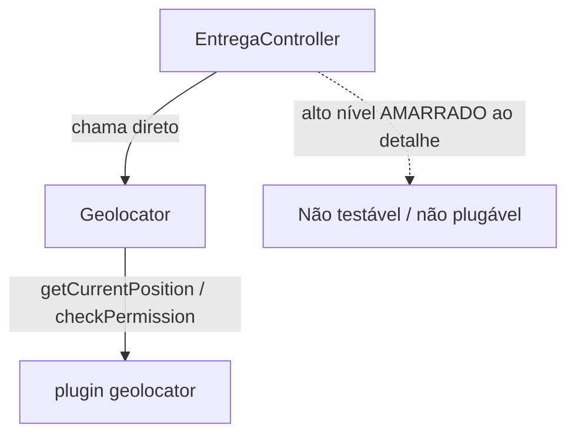
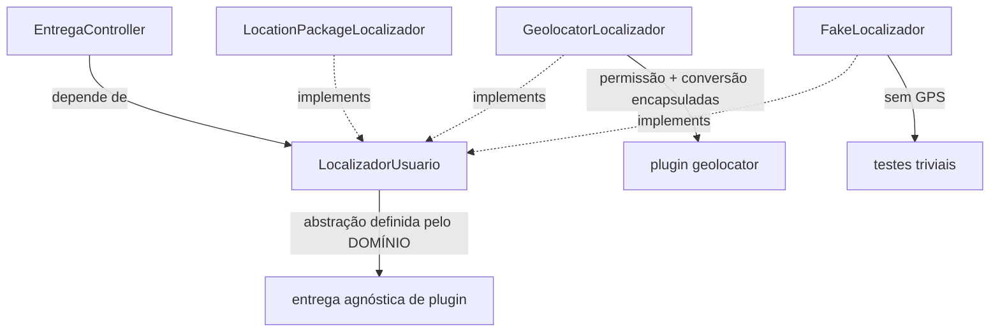

# DIP Dependency Inversion Principle

### Módulos de alto nível não devem depender de módulos de baixo nível. Ambos devem depender de abstrações.

### E mais: a abstração não depende do detalhe — o detalhe depende da abstração.

- A regra de negócio chama o plugin de localização (`Geolocator`) direto?
- Para testar, preciso de GPS / device real?
- Trocar de plugin (geolocator → location) obriga a mexer na regra de negócio?
- O domínio fala a língua do plugin (`Position`, `LocationPermission`) em vez da sua própria (`localizacaoAtual`, `Coordenada`)?

Se for sim então o alto nível está acoplado ao baixo nível e o DIP foi violado

### O nome engana

"Inversão" não é sobre ordem de chamada — é sobre a **direção da dependência**.

Normalmente o alto nível (política de negócio) aponta para o baixo nível (detalhe técnico). O DIP **inverte** isso: os dois passam a apontar para uma abstração no meio.

E o ponto que quase todo mundo esquece: **quem define a abstração é o alto nível**, no vocabulário do domínio (`localizacaoAtual`, `Coordenada`), não o baixo nível (`getCurrentPosition`, `checkPermission`). O detalhe se adapta ao domínio, não o contrário.

### O detalhe vira borda

Repare onde foi parar toda a dança de permissão, checagem de serviço e conversão de `Position`: dentro de `GeolocatorLocalizador`, isolada numa borda fina. A regra de negócio nunca encosta nisso. Trocar geolocator por location é trocar a borda, não o miolo — e em testes nem existe permissão para pedir.

### Como conversa com os outros princípios

- **DIP** é o que torna o resto viável: depender de abstração é o que permite **injetar** dependências (SRP), trocar implementações sem surpresa (LSP) e segregar interfaces por cliente (ISP).
- Sem DIP, a injeção de dependência do `LoginController` do SRP nem seria possível — ele teria que chamar `Geolocator` por dentro.

### Objetivo

- Desacoplar regra de negócio de detalhe de infraestrutura.
- Tornar a aplicação testável (injetar fakes/mocks, sem GPS).
- Tornar a infraestrutura plugável (trocar plugin sem tocar no domínio).
- Empurrar as decisões concretas para a borda da aplicação.

DIP não é "crie uma interface para tudo". É: onde a regra de negócio toca infraestrutura volátil (rede, SDK de terceiro, GPS), coloque uma abstração definida pelo domínio.

### O que mudou?

`EntregaController` parou de chamar `Geolocator` e passou a depender da abstração `LocalizadorUsuario`, **definida pelo domínio** com tipo próprio (`Coordenada`).

`GeolocatorLocalizador` e `LocationPackageLocalizador` agora dependem dessa abstração (implementam a interface), em vez de o controller depender delas. Toda a lógica de permissão e a conversão de `Position` ficaram encapsuladas na implementação.

A escolha do plugin concreto foi empurrada para a borda (injeção de dependência). A regra de negócio virou agnóstica de fonte de localização — e trivial de testar com um fake.

## Versão antiga:

## Versão nova:

